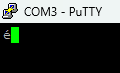
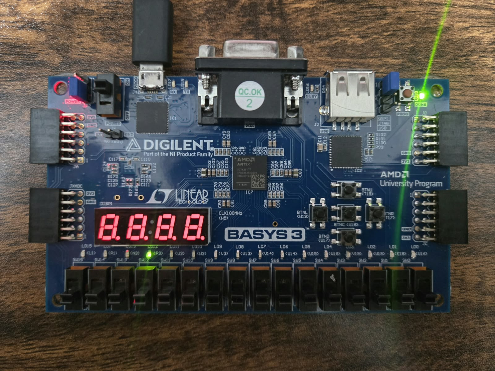
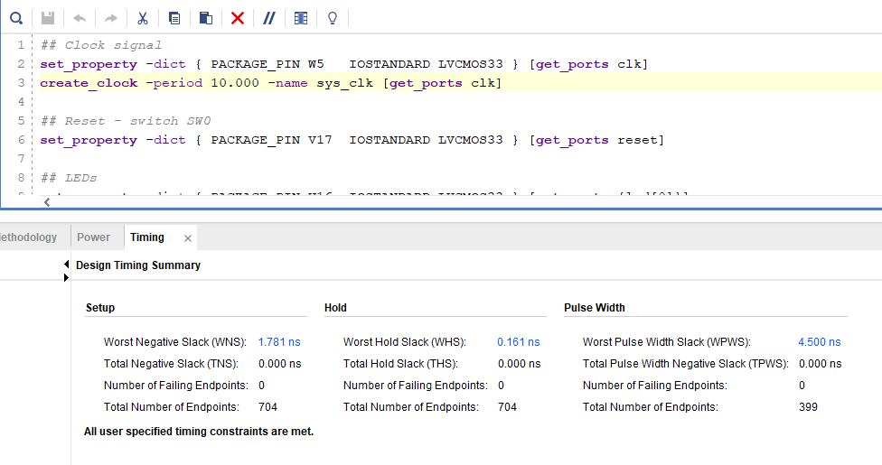
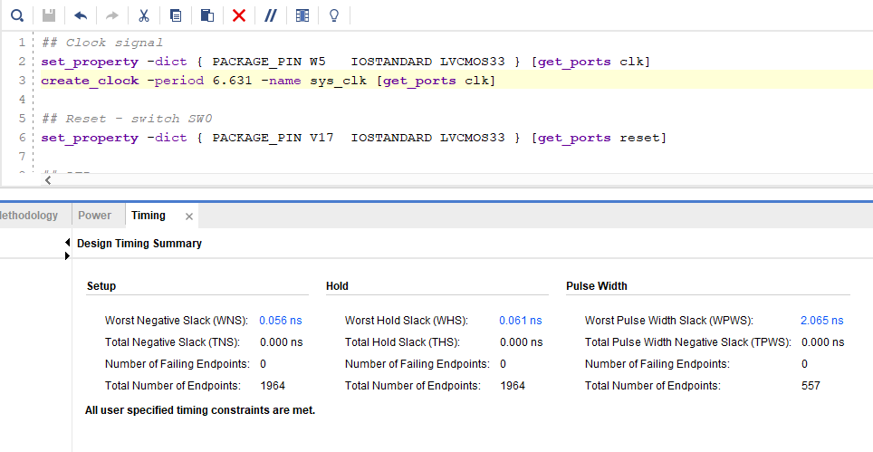
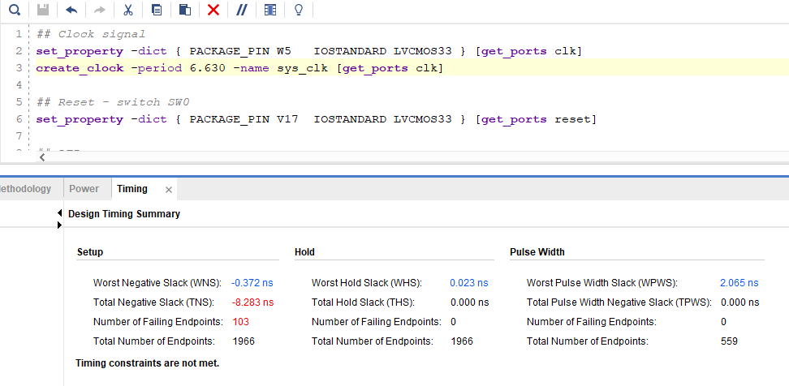
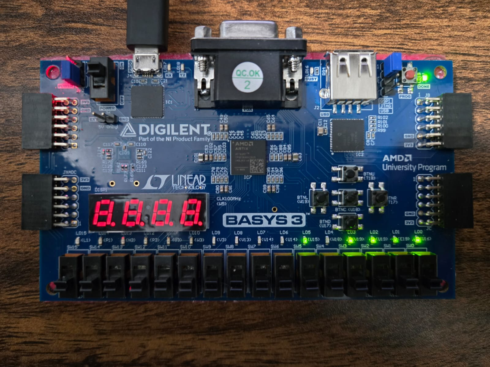

# rv32i-soc

A RISC-V RV32I system-on-chip built from scratch on a Basys 3 FPGA (Xilinx Artix-7).

A custom RV32I CPU connected over an AXI4-Lite interconnect to a UART peripheral,
verified by running the same programs on both the RTL and a C instruction set
simulator (ISS) written from scratch, and comparing the final register and memory
state.

**Status — the SoC is working, in RTL and on hardware.** After building the CPU,
the AXI4-Lite interconnect and the UART separately and verifying each, they now run
as one system: the first SoC-level program computes Fibonacci on the CPU, sends the
result across the AXI4-Lite bus to the UART, and transmits it to a PC terminal —
processor, interconnect and peripheral working together on the physical Basys 3 at
75 MHz. This is the "I built a SoC" milestone.

*Why 75 MHz:* the CPU alone closes timing at the board's 100 MHz, but the full SoC
integration does not — the added AXI and stall logic push the critical path past
10 ns. Rather than run at a failing 100 MHz or a conservative 50, the core clock is
generated at 75 MHz by an on-chip MMCM, closing with +0.739 ns of margin. Details in
[Design decisions](#design-decisions-for-the-hardware-soc).

*Next:* a more robust program that exercises all three of the UART's memory-mapped
AXI registers — a string-sender that writes bytes to TX_DATA and polls the STATUS
register between them so the transmitter is never overwritten mid-byte, printing
readable text to the terminal. Fibonacci stays as the co-simulation proof; the
string-sender becomes the full-peripheral hardware showcase.

*`F(12) = 233 = 0xE9` received over the UART, rendered as é in Latin-1. Each
character is one reset — the program computes Fibonacci and transmits the result
once per run.*

*The board running Fibonacci. The LEDs show the most recent write-back value, so
each term (1, 2, … 233) appears for one cycle — too fast to see at 75 MHz. The
last register write is `lui x10, 0x1` = 0x1000 (the UART base); the store and
halting branch after it write nothing, so the program freezes there. The single
lit LED, bit 12, confirms the CPU reached the instruction just before the
transmitting store.*

This is a minimal SoC: one CPU (master), one peripheral (UART slave), one AXI4-Lite
interconnect, one clock domain, on-chip memory. It is educational in scale, not
commercial — but the defining property of a system-on-chip is there: the processor
talks to the peripheral over a real, standard bus interconnect, not ad-hoc wires.

## Progress
- [x] ALU — RV32I integer ops (ADD, SUB, AND, OR, XOR, SLL, SRL, SRA, SLT, SLTU), 9-case testbench
- [x] Register file (32×32, 2 read / 1 write, x0 hardwired)
- [x] Instruction memory (ROM, `$readmemh` program load)
- [x] ISS (C reference model) — full fetch/decode/execute, all implemented instructions, halt detection
- [x] IF stage — PC register, fetch logic, branch/jump target mux
- [x] ID stage — control unit, immediate generator (all 6 formats), register file read
- [x] Data memory (BRAM, synchronous read, byte→word addressing)
- [x] EX + WB stage modules (ALU path, memory path, write-back mux)
- [x] First working CPU — top module, straight-line program executing
- [x] Python assembler — all six RV32I formats, `.s` source → `.hex` output
- [x] Branch resolution (BEQ, BNE) — EX → IF redirect, 2-cycle flush, counted loop running
- [x] ISS — branches (BEQ, BNE), jumps (JAL), loads/stores/LUI
- [x] Co-simulation (RTL vs ISS) — final register state compared automatically per program
- [x] Forwarding — 1-back via forwarding unit, 2-back via register file bypass, no stall
- [x] CPU running on the physical Basys 3
- [x] Timing closure and Fmax — CPU-only 100 MHz operating point, 150.8 MHz measured
- [x] AXI4-Lite slave (UART wrapper) — three memory-mapped registers, SLVERR, overrun, SVA protocol checkers
- [x] AXI4-Lite master (CPU side) — single outstanding transaction, stall on UART read
- [x] SoC integration — CPU ↔ AXI4-Lite ↔ UART, address decode, load stalls on peripheral read
- [x] Fibonacci in co-simulation — RTL and ISS agree, F(12) = 233
- [x] MMCM clock generation — 100 MHz board clock → 75 MHz core, reset gated on lock
- [x] **Fibonacci running on hardware — result transmitted over UART to a terminal**
- [ ] String-sender demo — multiple bytes with STATUS polling (readable text in the terminal)
- [ ] CPI measured on Fibonacci; SoC Fmax re-measured via stress test
- [ ] Python regression script — every testbench, PASS/FAIL summary
- [ ] SoC block diagram, ISA table, register map for the final README

## Structure
- `rtl/` — SystemVerilog source
- `tb/` — testbenches
- `iss/` — C instruction-set simulator (golden reference model)
- `tools/` — Python assembler
- `programs/` — assembly source and generated hex, one folder per program
- `cosim/` — register dumps from the RTL and the ISS, compared per program
- `constraints/` — Basys 3 pin and clock constraints
- `docs/` — design notes and bug logs, folder with readme images

## Target
Xilinx Artix-7 (Basys 3), Vivado.

## What is done, and what is next

**Done.** The four goals the project was built around are complete and on hardware:
a real bus integration (AXI4-Lite, CPU to UART), co-simulation against a
from-scratch C ISS, a measured timing / Fmax story with the critical path
identified, and a verification-first method — self-checking testbenches, SVA
protocol checkers on the AXI slave, corner cases written before the testbench, and
per-module bug logs.

**Next, in order.** These are refinements and demos on top of a working SoC, not
missing pieces of it:

- **String-sender demo.** Fibonacci sends one byte; a richer program sends several,
  polling the UART's STATUS register between characters so the transmitter is never
  overwritten mid-byte. This exercises the whole SoC — repeated stores across the
  bus, STATUS reads back across it, the stall — and prints readable text. Fibonacci
  stays as the co-simulation proof (it has a hand-checkable answer); the
  string-sender becomes the hardware showcase.
- **Measurements.** CPI on Fibonacci (the 2-cycle branch penalty becomes a number),
  and the SoC's Fmax re-measured with the same stress-test bisection used on the
  CPU alone — the integrated design's critical path is slower, and quantifying that
  gap is the point.
- **Automation and docs.** A Python regression runner over every testbench, plus a
  SoC block diagram, ISA table and register map for the final README.

**Deferred to v2 (deliberately, not forgotten).** Runtime program loading over UART
(turns the instruction ROM into a writable BRAM), an asynchronous FIFO with Gray-code
pointers to cross clock domains (the natural sequel to the single-clock v1), the
remaining RV32I instructions, and a 5-stage upgrade with a branch predictor.

## Design decisions for the hardware SoC

Bringing the SoC to hardware forced a few choices, each made from the timing
report rather than a preference.

**75 MHz core clock via an MMCM.** The CPU alone closes at 100 MHz, but the full
SoC does not — with the AXI master, UART slave and stall logic added, the critical
path (data-memory read → PC redirect) misses 100 MHz by 0.838 ns. The Basys 3's
only clock is a fixed 100 MHz crystal, so a slower core clock is generated on-chip
by an MMCM (a PLL on dedicated clock routing, not a flip-flop divider). 75 MHz was
chosen from the report: the path needs ~10.85 ns, 75 MHz gives 13.33 ns, and the
build closes at +0.739 ns — the highest round frequency with real margin. Reset is
gated on the MMCM's `locked` output (`sys_reset = reset | ~locked`), holding the
CPU until the clock is stable. The IP is not committed; regenerate via IP Catalog →
Clocking Wizard (100 MHz in, 75 MHz out).

**Fibonacci as the first hardware program.** It was already the co-simulation proof
— a counted loop with a hand-checkable answer, matching on RTL and ISS. Running the
same known-correct program on hardware means any wrong byte is a clock, baud or pin
fault, not a program bug. F(12) = 233 is also the largest term that fits in a byte,
so the whole result transmits in one UART frame.

**Baud divider follows the clock.** The UART times each bit by counting core-clock
cycles, so the divider tracks the clock, not just the baud. At 75 MHz a
115200-baud bit is 651 cycles (0.006% error), down from 868 at 100 MHz. This is the
one constant that must move with the clock — a mismatch sends the right byte at the
wrong rate and the terminal shows garbage.

## Scope for v1.0

Some RV32I instructions are deliberately left out. The demo programs are counted
loops with word-aligned memory access, so they need arithmetic and logic R/I-types,
`lw`, `sw`, `lui`, `beq` and `bne` — all implemented.

Not implemented: `blt`, `bge`, `bltu`, `bgeu` (the sign bit of a subtraction cannot
give a correct signed comparison when the subtraction overflows, so these need
either a funct3-dependent ALU operation or a dedicated comparator). byte and
halfword loads and stores (which need lane enables in the data memory); `jalr` and
`auipc`.

None of these block the project's goals — bus integration, co-simulation, measured
timing, and verification discipline — so ISA coverage is deferred, not forgotten.

## Architecture

Harvard architecture — instruction and data are separate memories, so fetch and
data access never contend for one port.

### Update, 30 July 2026: this core is 4-stage, not 3-stage

I first described this design as 3-stage (IF/ID, EX, WB), because I counted the
pipeline registers I wrote myself, and I wrote two. But a pipeline register is
any register that separates two stages — it does not matter who put it there.
Counting that way gives three boundaries and four stages.

The one I missed is IF→ID. My instruction memory has a registered output: the
instruction arrives one cycle after the address is presented. That output
register is a pipeline register — I just didn't think of it as one. So fetch gets
its own cycle, and IF and ID are separate stages.

I had already used this exact reasoning elsewhere in the design. There is no MEM
stage here because the data memory's output register serves as the EX→WB
boundary. The instruction memory's output register is the same construct at
IF→ID. Either both count as boundaries or neither does, so the design is
4-stage: IF, ID, EX, WB.

| boundary | provided by |
|---|---|
| IF → ID | instruction memory output register |
| ID → EX | pipeline register I wrote (16 signals) |
| EX → WB | pipeline register I wrote (5 signals), plus the data memory output register for the loaded value |

One consequence: branches resolve in EX, which is stage 3, so two wrongly
fetched instructions sit behind it in ID and IF. The branch penalty is 2 cycles,
not 1 as I had assumed.

### Why I kept 4 stages instead of merging ID and EX

Once I knew it was 4-stage, a real design question followed: 

**Should i merge ID/EX into one stage (IF, ID/EX, WB)?**

ID is purely combinational — field slicing, control decode, immediate
generation, and the register file read. The only thing separating it from EX is
a pipeline register I put there myself, and I could remove it. That would give a
genuine 3-stage pipeline with better CPI: the branch penalty drops to 1 cycle,
and the hazard distance shrinks from 3 instructions to 2.

I decided not to answer this by arguing. I built the first working CPU as
4-stage, added timing constraints for the Basys 3's 100 MHz clock, ran
implementation, and read the critical paths.

**Baseline timing, 30 July.** Post-implementation at 100 MHz, measured on a
straight-line CPU before branch resolution and forwarding existed. These are
*not* the current numbers — both additions land on the EX path and cost slack.
See [Timing and Fmax](#timing-and-fmax) below for where the design stands now.

| metric | value |
|---|---|
| WNS | 4.187 ns |
| failing endpoints | 0 |
| worst path | instruction memory output → register file read → ID/EX register |
| ID critical path | 5.814 ns |
| EX critical path | 5.503 ns |

No Fmax is quoted here. This build was never stress-tested, and the formula
estimate from a relaxed constraint understates the design — see
[Timing and Fmax](#timing-and-fmax). The numbers above are used only to compare
the two stages against each other, which they do fairly since both come from the
same build.

Two things came out of this.

**The split is balanced.** A pipeline's clock period is set by its slowest
stage, so if ID took 5.8 ns and EX took 2 ns, the clock would still be 5.8 ns
and EX would sit idle for most of every cycle — The fix would be slicing the
slowest stage into 2 stages if i want more fmax, and I would have paid for that
boundary in flip-flops, latency, and branch penalty without getting speed back.
At 5.814 ns and 5.503 ns the two stages are within 0.31 ns, so both use nearly
the whole period and there's no reason to slice.

**Merging them would not close timing.** Chained in one clock period, ID and EX
come to roughly 11 ns, and the period at 100 MHz is 10 ns. There is no margin to
spend, and forwarding lands directly on the EX path later, which would only make
the merged version worse.

So I kept 4 stages and chose frequency over CPI: I pay a 2-cycle branch penalty
in exchange for timing closure with margin.

**One more thing the report showed.** The worst path has only 2 levels of logic,
and 4.796 ns of its 5.814 ns total is net delay — wires, not gates — on a signal
with a fanout of 66. Pipelining fixes a path by cutting a long chain of gates
into two shorter chains, but there is no long chain here to cut, and a register
in the middle does not make a wire shorter. So more stages would not help this
path; reducing fanout and improving placement would.

Everything above is the state before forwarding. The current numbers are in
[Timing and Fmax](#timing-and-fmax).

## Data hazards

Two hazards, two fixes, no stalls.

A dependency **one instruction back** is caught by a forwarding unit, which
compares the destination register of the instruction in write-back against both
source registers of the instruction in execute and muxes the value straight into
the ALU inputs. Forwarding into decode instead would chain the ALU output onto
the register-file read path inside one clock period, which would not close
timing.

A dependency **two instructions back** is caught by a write-first bypass inside
the register file: a read of the register being written this cycle returns the
incoming value rather than the stale stored one. Three instructions back needs
nothing.

The forwarded value is the write-back stage's output, not the ALU result.
Write-back already picks between the ALU result, loaded data and a jump's return
address, so forwarding its output inherits that choice — one signal covers all
three and the forwarding select stays a single bit.

**Load-use needs no stall here**, which a textbook pipeline cannot manage.
Normally a loaded value is not ready until after the dependent instruction needs
it, forcing a one-cycle interlock. Here the data memory's output register *is*
the EX→WB boundary, so the loaded value appears exactly one cycle after the
address — precisely when the next instruction's ALU wants it. The same decision
that removed the MEM stage removed the load-use stall.

Verified by co-simulation: eight back-to-back dependent instructions with no
spacers, covering every forwarding path, matching the reference model exactly.

## Timing and Fmax

> **Note.** The numbers in this section characterise the **CPU alone**, before AXI
> and the UART were integrated. They remain the reference for the core's timing
> story and its measured ceiling. The full SoC is larger and its critical path is
> slower — it runs at 75 MHz on the board (see
> [Design decisions](#design-decisions-for-the-hardware-soc)), and its Fmax will be
> re-measured with the same stress-test method. This section is kept as the
> CPU-only baseline.

Two builds are reported here, and they answer different questions. The 100 MHz
build is the CPU alone, closing at the Basys 3's crystal frequency. The tighter
builds are experiments: they could never run, since there is no 150 MHz clock
without a PLL, but they are how the ceiling gets measured.

### Operating point

The build running on the board, with `program_forwarding.hex` loaded:

| metric | value |
|---|---|
| WNS | 1.781 ns |
| WHS | 0.161 ns |
| failing endpoints | 0 |

*Design timing summary at the 100 MHz operating point — all constraints met, no
failing endpoints.*

The critical path runs inside the data memory: its output register feeds the
write-back mux, the forwarding mux and the ALU, and returns to the memory's own
address port. That loop is what makes load-use forwarding work without a stall.

| field | value |
|---|---|
| total delay | 7.592 ns |
| — time inside gates | 3.943 ns |
| — time travelling on wires | 3.649 ns |
| gates in a row | 5 |

Note that the numbers depend on which program is loaded. `$readmemh` bakes the
program into the bitstream, so instruction types the program never uses leave
decode paths unreachable and synthesis prunes them. These figures are for
`program_forwarding.hex`, the program that exercises every hazard path.

### How fast could it go: 150.8 MHz

100 MHz is the clock the board provides, not the fastest this design can run. To
find that, I tightened the clock constraint step by step and re-ran
implementation until the design failed. These builds are measurements, not
deliverables — the board cannot generate a 150 MHz clock without a PLL:

| period | WNS | result |
|---|---|---|
| 6.631 ns | +0.056 ns | passes |
| 6.630 ns | −0.372 ns | fails, 103 endpoints |

**150.8 MHz**, narrowed down to a 1 picosecond boundary.

*6.631 ns: closes with 0.056 ns to spare, no failing endpoints.*

*6.630 ns: 103 endpoints fail. One picosecond lower is the difference between
closure and a design that will not work.*

The usual shortcut is `Fmax = 1 / (period − WNS)`, which from the 100 MHz numbers
gives 122 MHz — an underestimate by 24%. The WNS itself is correct; the mistake is
using it to predict a frequency. The formula assumes the path delay is fixed, but
Vivado stops optimising once the constraint is met: given 10 ns with 1.8 ns to
spare it had no reason to try harder, and given 6.6 ns it found a faster
arrangement of the same RTL. That relaxed build costs nothing — timing is pass or
fail, and extra slack buys nothing at a fixed 100 MHz — but it does mean the
formula only ever gives a floor.

How much harder the tool works is visible in the endpoint count: 704 at 10 ns
against 1964 at 6.631 ns. Under pressure it replicates registers and splits logic
that it was content to share when the constraint was loose.

### Resource utilisation

| resource | used | available | % |
|---|---|---|---|
| LUT | 448 | 20800 | 2.2 |
| FF | 396 | 41600 | 1.0 |
| BRAM | 0.5 | 50 | 1.0 |
| IO | 18 | 106 | 17.0 |

The data memory occupies half of one block RAM tile; everything else is a couple
of percent of the device. Pins are the tightest resource at 17%, and the UART will
add two more.

### Why only one memory became a block RAM

This design has three arrays and they synthesise three different ways, which is a
useful illustration of how the tool decides.

| array | contents change at runtime? | read | result |
|---|---|---|---|
| instruction memory | no | synchronous | constants folded into logic |
| data memory | yes | synchronous | block RAM (RAMB18E1) |
| register file | yes | **combinational** | flip-flops / distributed RAM |

Two questions decide it, in order.

**First: does it need real storage at all?** The instruction memory does not.
`$readmemh` loads the program at synthesis time and there is no write port, so
every one of its 256 entries is a compile-time constant. At that point it is not
a memory — it is a fixed lookup table, and Vivado folds it into 90 LUTs. For a
table where most entries are zero, that is far cheaper than spending a block RAM
tile. The other two arrays do change while the CPU runs, so they need storage.

**Second: what kind of storage?** Block RAM physically cannot read without a
clock; the read is registered inside the primitive. The data memory reads
synchronously, so it qualifies, and it becomes a RAMB18E1 occupying half a tile.
The register file cannot: decode needs both operands in the same cycle it reads
them, so its read is combinational, and a block RAM would deliver them a cycle
late. It becomes flip-flops instead.

So "it has a write port" is not enough to get a block RAM, and "the read is
synchronous" is not enough either. Both have to hold.

**This does not affect the four-stage argument.** The instruction memory's output
register is written explicitly in the RTL — `instruction <= memory[addr]` inside
an `always_ff` — so the flop exists no matter what happens to the array behind it.
The IF→ID pipeline boundary exists either way.

**Left as it is, deliberately.** A `rom_style = "block"` attribute would force the
instruction memory into a BRAM and make the wording tidier, but constants in logic
are faster than a memory lookup, so it would cost frequency for no gain.

### On hardware

The design runs on the Basys 3 at 100 MHz, executing the forwarding test program
— the one that exercises every hazard path.

The LEDs display the low 16 bits of the write-back value. That signal is chosen
deliberately: every instruction that writes a register passes through the
write-back mux, so producing it requires the whole datapath — fetch, decode, the
pipeline registers, the ALU, the data memory and the forwarding logic. Driving the
LEDs from a single register instead would let synthesis delete everything not
needed to compute that one value, which it does: the endpoint count drops from
2239 to 16.

*Each bit's brightness reflects how often it is high. The program runs
continuously — the instruction memory holds 256 words, so after the last
instruction the program counter runs through zeroed entries, wraps, and starts
again, roughly 390,000 laps a second at 100 MHz. Only the low bits light, which
is what the program's results predict.*
